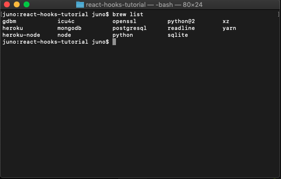
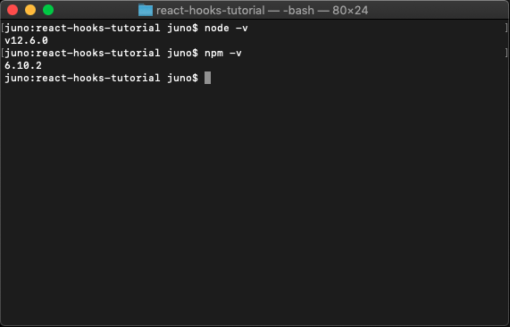

# Required Tech 

Below you'll find a list of things you'll need to be downloading. 
* __Git__ (This should come with Apple products already)
    - for Windows users (https://www.youtube.com/watch?v=nbFwejIsHlY)
 
* __Homebrew__
    - copy and paste this into your terminal
        - /usr/bin/ruby -e "$(curl -fsSL https://raw.githubusercontent.com/Homebrew/install/master/install)"
    - Read more about Homebrew here: https://brew.sh/
 
* Node
    - in your terminal type the following: 
        - brew update (updates homebrew with latest version of Node)
        - brew install node 
 
* __Visual studio code__
    - download the appropiate operating system for your device here: (https://code.visualstudio.com/download)

# Verify if you had downloaded these techs. 
- In your terminal type: 
     
    - __brew list__  
        - you should see a list of tech that you've installed via Homebrew, if you've just downloaded it, you should see node since we've just installed in. 

     
    - __node -v__
     
    - __npm -v__
     
        - if the return result shows you versions of node/npm, you've got them installed! 
